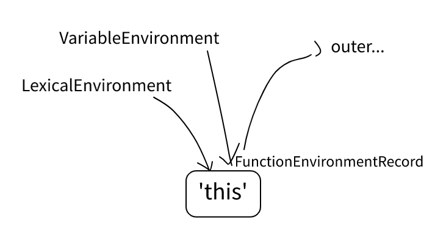
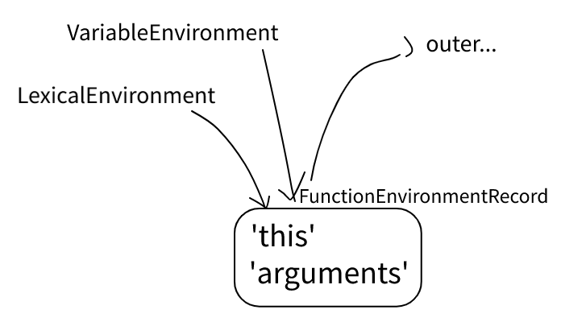
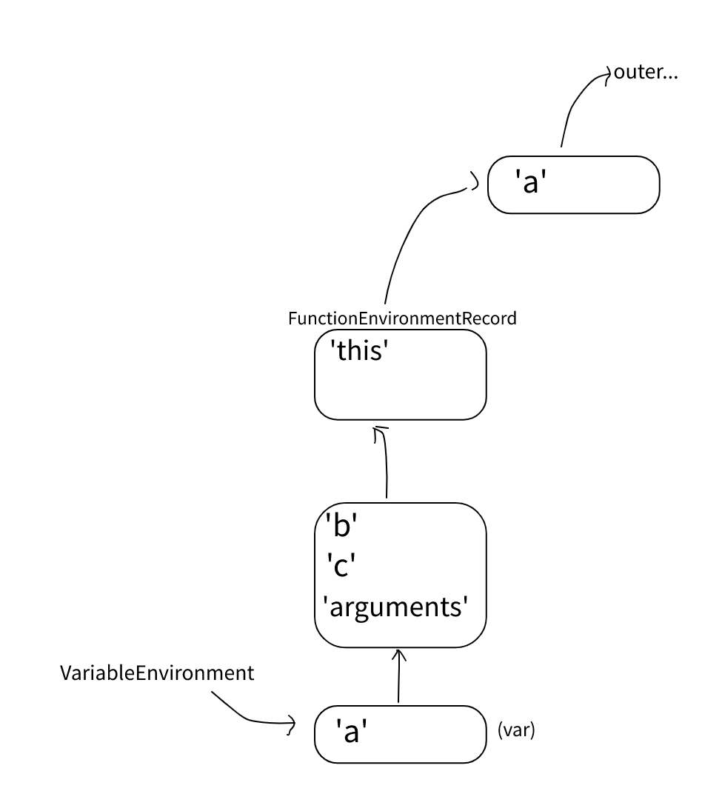

# 作用域 - 函数

`#sec-functiondeclarationinstantiation`


## 1. 准备工作

当函数被调用的时候，会创建一个*function Environment Record*（函数环境，或者就叫函数作用域吧），用来记录参数和其他变量的绑定关系。

```
// #sec-prepareforordinarycall
// 创建新的运行上下文和函数作用域
let calleeContext = NewExecutionContext;
let localEnv = NewFunctionEnvironment;
calleeContext.LexicalEnvironment = localEnv;
calleeContext.VariableEnvironment = localEnv;
suspend RunningContext;
push calleeContext; // ...ready

// #sec-ordinarycallbindthis
// 绑定this
// 这个就不多解释了，应该都知道，比如箭头函数没有，
// 唯一有可能不清楚的应该就是在strict模式
// 'use strict;' function f() { console.log(this) }
// f.call(null), f.call(undefined)
// 因为strict的判断在thisArgument的判断之前，具体看规范。

```

至此，当前的函数作用域里只有`this`的绑定（箭头函数没有）。




## 2. 函数形参

### 2.1 空

```js
function f() {}
```

即使这个函数什么都没有，它还是有个"arguments"。



### 2.2 简单情形

```js
function f(a) {}
```

跟上面的区别就是多了一个"a"。

另外，如果有个叫"arguments"的参数，就没有上面的那个arguments了。

### 2.3 形参里有表达式

当形参里有表达式，**并且**不在strict模式的时候，会创建一个额外的env来放这些参数的绑定。

```js
function f(a = whatever) {}
```


> 为什么？
> 因为要让eval()产生的绑定放在这些形参的外面

> 下面写的一些代码只是为了尽量说明语言的“能力”，第一眼看不懂也不要紧，
> 因为你永远都不会看到这样的代码，也不需要写出这样的代码，不然打死活该。

```js
// eval的'x'在a,b,c(和arguments)的外面，这里也就是在函数作用域那一层(与'this'同级)
// 就不画图了，参考上面的自己放进去即可

function (a = 1, b = eval('var x = a*2;x;'), c = x+3) {
  console.log(a, b, c, x);
}
```

清楚了吗？

别急着回答，你是真的清楚了还是以为清楚了。

上面的“为什么？因为...”看似写明了原因，实际上却是个结果。

除非你已经了解eval()的过程，不然我很怀疑这几句话和例子能彻底
解释清楚“多的这层env的意义到底是什么”而不是让你更加困惑。

> 想想，为什么eval()要这样？
> 这才是更关键的问题，但是等一下再看，因为很快会再次碰到。(#sec-evaldeclarationinstantiation)

再想一个问题，上面说是不能在strict模式下，那如果在strict模式下会怎么样？

简单说下，因为严格模式下，eval里面的var与let在同一个作用域，也就是说
它的var跑不出来，所以就不需要额外新加的这层了。具体的以后单独写一下eval。


## 3. 函数体

接下来是函数体里面的var和let。

在这之前，再看一眼形参。如果形参里有表达式，考虑这种情形：

```js
// a函数里可以访问到b，因为他们在同一个作用域。那c呢？
function f(
  a = () => { b(); },
  b = () => { console.log(c); }
) {
  var c = 1;
  a();
}
```

好像...不太确定可不可以这样？再写个例子，

```js
let a = 1;

function f(
  b = a, // 这个应该必须只能用外面的a吧
  c = () => { return a; } // 哪个a
) {
  var a = c();
}
```

所以，如果形参有表达式，则有必要为函数体隔出一个新的作用域。上面这段的结果是



### 3.1 let

var有位置了，let呢，跟var一起吗？

> “let是块作用域，var是什么什么作用域，所以他们是隔开的”
>
> 哦，这就有点死记硬背了。
> 作用域是什么，这俩的作用域水火不容吗，为什么要隔开，怎么隔。
>
> 前一篇写过了，EnvRec有DeclarativeEnvRec，FunctionEnvRec，以及其他
> 跟这里无关的几个。并且FunctionEnvRec也是DeclarativeEnvRec。
>
> 其次，运行上下文里有VariableEnvironment和LexicalEnvironment，这应该
> 就是所说的“var所在的作用域”和“let所在的块作用域”，可是为什么必须要求
> 他们指向两个不同的EnvRec呢？
>
> 还是那句话，不要强行去记忆一句话或一个观点，然后信誓旦旦的说自己明白了。

还是先看个例子。

```js
function f1() {
  var a = 1;
  let b = 1;
  var a = 2*a;
  var b = 2*b;
}

function f2() {
  var a = 1;
  let b = 1;
  eval('var a = 2*a;'); // ok
  eval('var b = 2*b;'); // error
}
```

这两个函数报的错是一样的，但是报错的时机是不同的。

- `f1`在解析阶段就会报错 (#sec-function-definitions-static-semantics-early-errors)
- `f2`在被调用才报错，因为字符串都还没被解析 (#sec-evaldeclarationinstantiation)

```js
// 另外提一下，如果把上面两行合到一起，a的值也不会被改动，
// 因为这个字符串解析后得到的脚本里面的语句都不会被执行。
eval('var a = 2*a; var b = 2*b;');
SyntaxError: Identifier 'b' has already been declared

// 都说到解析了，简单说下上面的错误和解析时错的区别吧，
eval('var x; let x;');
SyntaxError: Identifier 'x' has already been declared

// 虽然这两个报的错是一样的，但时机不同。
// 上面的字符串解析成脚本是OK的，报错是因为之后碰到了外面let声明的b。
// 而下面的字符串解析就报错，因为let和var声明了同一个名字x。
```

如果是从前一篇作用域看过来的，那么，现在应该有能力推测出: eval()是怎么处理里面的`var`的，以及为什么此时需要多一层作用域以记录`let/const`。（跟上面说到形参时留下的问题是同一个）

提示一下，EnvRec里的绑定关系并没有记录这个绑定是let来的还是var来的。

留白。
